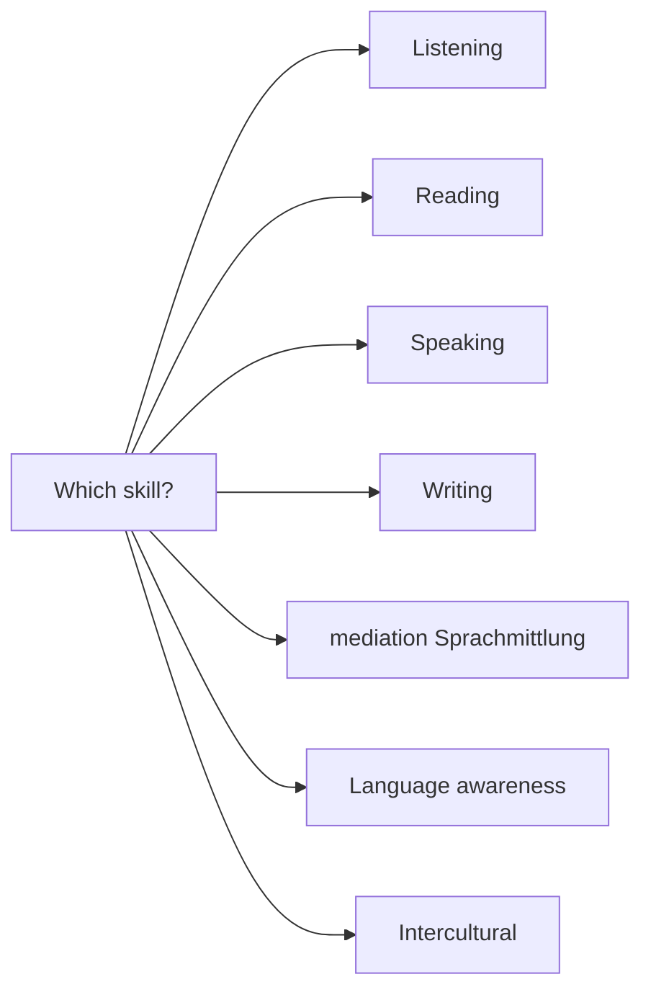

Pick a skill area, then jump to representative Units across the
fifteen courses. Generated from front-matter scans (3 representative
Units per skill).

## Listening — representative Units

[Kl.5/G+M](/track-gm/kl05/units/unit01-hello-world/) · [Kl.5/G+M](/track-gm/kl05/units/unit04-school-day/) · [Kl.5/G+M](/track-gm/kl05/units/unit07-weather-and-seasons/)

## Reading — representative Units

[Kl.5/G+M](/track-gm/kl05/units/unit03-home-and-room/) · [Kl.5/G+M](/track-gm/kl05/units/unit05-food-and-drinks/) · [Kl.5/G+M](/track-gm/kl05/units/unit06-animals-and-pets/)

## Speaking — representative Units

[Kl.5/G+M](/track-gm/kl05/units/unit01-hello-world/) · [Kl.5/G+M](/track-gm/kl05/units/unit02-my-family/) · [Kl.5/G+M](/track-gm/kl05/units/unit04-school-day/)

## Writing — representative Units

[Kl.5/G+M](/track-gm/kl05/units/unit02-my-family/) · [Kl.5/G+M](/track-gm/kl05/units/unit03-home-and-room/) · [Kl.5/G+M](/track-gm/kl05/units/unit06-animals-and-pets/)

## Mediation (Sprachmittlung) — representative Units

[Kl.7/G+M](/track-gm/kl07/units/unit08-first-mediation/) · [Kl.8/G+M](/track-gm/kl08/units/unit07-teen-magazine-mediation/) · [Kl.9/G+M](/track-gm/kl09/units/unit07-mediation-news-article/)

## Language awareness — representative Units

[Kl.5/G+M](/track-gm/kl05/units/unit01-hello-world/) · [Kl.5/G+M](/track-gm/kl05/units/unit02-my-family/) · [Kl.5/G+M](/track-gm/kl05/units/unit03-home-and-room/)

## Intercultural — representative Units

[Kl.5/G+M](/track-gm/kl05/units/unit10-a-day-in-london/) · [Kl.6/G+M](/track-gm/kl06/units/unit02-on-holiday/) · [Kl.6/G+M](/track-gm/kl06/units/unit04-food-around-the-world/)

<!-- VG Wort Zählmarke (slb) — public ID: 00256953c3354316922af74639998a18 -->

